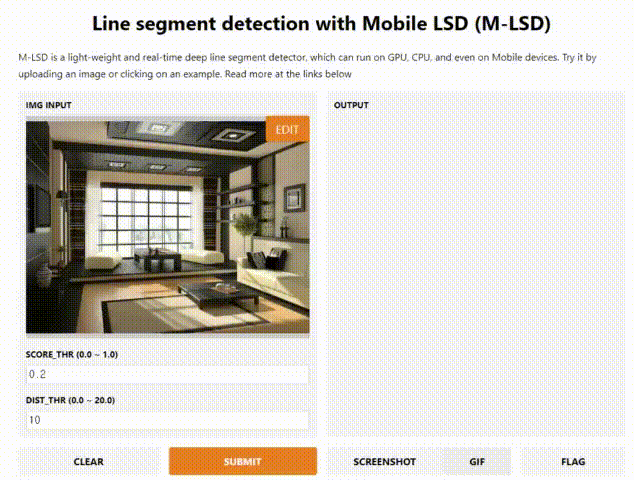

# M-LSD: Towards Light-weight and Real-time Line Segment Detection

Official Tensorflow implementation of *"M-LSD: Towards Light-weight and Real-time Line Segment Detection"*

**Geonmo Gu\*, Byungsoo Ko\*, SeoungHyun Go, Sung-Hyun Lee, Jingeun Lee, Minchul Shin**
(* Authors contributed equally.)

@NAVER/LINE Vision

[Paper](https://arxiv.org/abs/2106.00186) | [Colab](https://colab.research.google.com/gist/geonm/16b7e4bad577511d2313bf0337029bfc/mlsd_demo.ipynb) | [PPT](https://www.slideshare.net/ByungSooKo1/towards-lightweight-and-realtime-line-segment-detection)

 Integrated to [Huggingface Spaces](https://huggingface.co/spaces) with [Gradio](https://github.com/gradio-app/gradio). See demo: [](https://huggingface.co/spaces/akhaliq/mlsd)



## Overview
<p float="left">
  
  
</p>


**First figure**: Comparison of M-LSD and existing LSD methods on *GPU*.
**Second figure**: Inference speed and memory usage on *mobile devices*.

We present a real-time and light-weight line segment detector for resource-constrained environments named *Mobile LSD (M-LSD)*.
M-LSD exploits extremely efficient LSD architecture and novel training schemes, including SoL augmentation and geometric learning scheme.
Our model can run in real-time on *GPU*, *CPU*, and even on *mobile devices*.

## Line segment & box detection demo


We prepared a line segment and box detection demo using M-LSD models. This demo is developed based on python flask, making it easy to see results through a web browser such as Google Chrome.

All M-LSD family are already converted to tflite models. Because it uses tflite models, it does not require a GPU to run the demo.

Note that we make the model to receive RGBA images (A is for alpha channel) as input to the model when converting the tensorflow model to the tflite model, in order to follow [**TIPs for optimization to mobile gpu**](https://www.tensorflow.org/lite/performance/gpu#tips_for_optimization).

Don't worry about alpha channel. In a stem layer of tflite models, all zero convolutional kernel is applied to alpha channel. Thus, results are same regardless of the value of alpha channel.

Post-processing codes for a box detection are built in Numpy. If you consider to run this box dectector on mobile devices, we recommend porting post-processing codes to [eigen3](https://eigen.tuxfamily.org/index.php?title=Main_Page)-based codes.

<p float="left">
  
  
  
</p>

*Above examples are captured using M-LSD tiny with 512 input size*

### How to run demo
#### Install requirements
```
$ pip install -r requirements.txt
```
#### Run line segment and box detector demo
```
$ python demo_MLSD.py
```

#### Run line segment detector demo with gradio
```
$ python linedemo.py
```

### Colab notebook
You can jump right into line segment and box detection using M-LSD with our [Colab notebook](https://colab.research.google.com/gist/geonm/16b7e4bad577511d2313bf0337029bfc/mlsd_demo.ipynb).
The notebook supports interactive UI with [Gradio](https://gradio.app/) as below.


### Pytorch demo
https://github.com/lhwcv/mlsd_pytorch (by [lhwcv](https://github.com/lhwcv))

## How to convert ckpt models to tflite models
NOTE: When using **Tensorflow 2.3.0 version**, tflite converter can convert the ckpt models without any problem.
```
# M-LSD_512_large_fp32 with RGBA input
python frozen_models.py \
--model_path=./ckpt_models/M-LSD_512_large \
--model_tflite_path=./tflite_models/M-LSD_512_large_fp32.tflite \
--input_size=512 \
--map_size=256 \
--batch_size=1 \
--dilate=5 \
--with_alpha=True \
--backbone_type=MLSD_large \
--topk=200 \
--fp16=False

# M-LSD_320_large_fp32 with RGBA input
python frozen_models.py \
--model_path=./ckpt_models/M-LSD_320_large \
--model_tflite_path=./tflite_models/M-LSD_320_large_fp32.tflite \
--input_size=320 \
--map_size=160 \
--batch_size=1 \
--dilate=5 \
--with_alpha=True \
--backbone_type=MLSD_large \
--topk=200 \
--fp16=False

# M-LSD_512_tiny_fp32 with RGBA input
python frozen_models.py \
--model_path=./ckpt_models/M-LSD_512_tiny \
--model_tflite_path=./tflite_models/M-LSD_512_tiny_fp32.tflite \
--input_size=512 \
--map_size=256 \
--batch_size=1 \
--dilate=5 \
--with_alpha=True \
--backbone_type=MLSD \
--topk=200 \
--fp16=False

# M-LSD_320_tiny_fp32 with RGBA input
python frozen_models.py \
--model_path=./ckpt_models/M-LSD_320_tiny \
--model_tflite_path=./tflite_models/M-LSD_320_tiny_fp32.tflite \
--input_size=512 \
--map_size=256 \
--batch_size=1 \
--dilate=5 \
--with_alpha=True \
--backbone_type=MLSD \
--topk=200 \
--fp16=False
```

## Citation
If you find *M-LSD* useful in your project, please consider to cite the following paper.

```
@misc{gu2021realtime,
    title={Towards Real-time and Light-weight Line Segment Detection},
    author={Geonmo Gu and Byungsoo Ko and SeoungHyun Go and Sung-Hyun Lee and Jingeun Lee and Minchul Shin},
    year={2021},
    eprint={2106.00186},
    archivePrefix={arXiv},
    primaryClass={cs.CV}
}
```

## License
```
Copyright 2021-present NAVER Corp.

Licensed under the Apache License, Version 2.0 (the "License");
you may not use this file except in compliance with the License.
You may obtain a copy of the License at

    http://www.apache.org/licenses/LICENSE-2.0

Unless required by applicable law or agreed to in writing, software
distributed under the License is distributed on an "AS IS" BASIS,
WITHOUT WARRANTIES OR CONDITIONS OF ANY KIND, either express or implied.
See the License for the specific language governing permissions and
limitations under the License.
```
